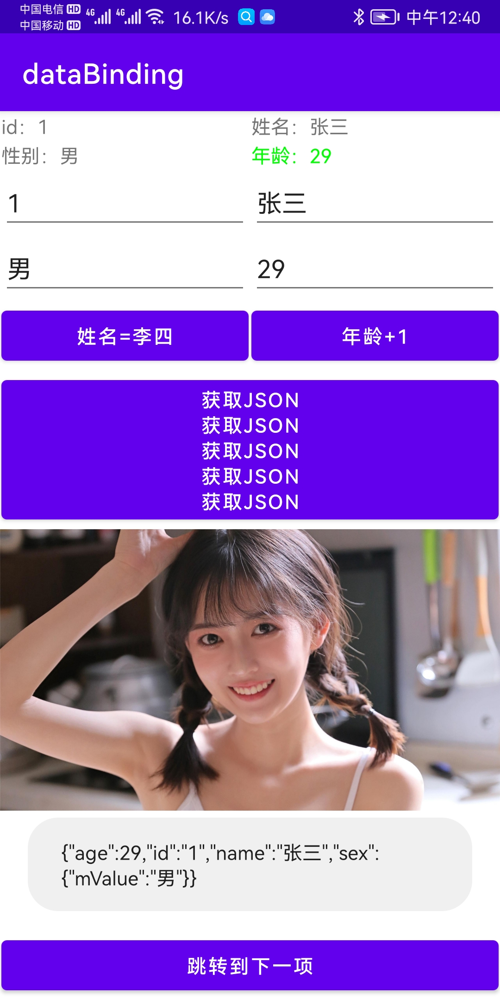

# DataBinding 学习

## 好好学习 天天向上

1. 解决 findViewById(R.id.xx)
2. 单向绑定 （给界面设置实体，界面显示实体值）
3. 双向绑定 （界面输入框值改变，实体中值跟着改变）
3. 双向绑定自动刷新界面 （界面输入框值改变，实体中值跟着改变，并且界面上用到该属性的地方都改变）
4. DataBinding 对 RecyclerView 中 adapter 使用
5. 注解使用: @BindingAdapter ，给view在xml中使用时新增属性

**[releases里面有APK文件。点击前往](https://github.com/yutils/databinding/releases)**

**效果图**




举例：
```xml
<?xml version="1.0" encoding="utf-8"?>
<layout xmlns:android="http://schemas.android.com/apk/res/android"
    xmlns:app="http://schemas.android.com/apk/res-auto"
    xmlns:tools="http://schemas.android.com/tools">

    <!--修改databind类名称，如果加.就是工程目录，否则就是com.kotlinx.databinding.databinding.ActivityMainBinding-->
    <data class=".Bd">
        <import type="com.kotlinx.databinding.main.User" />
        <import type="android.widget.Toast" />
        <variable
            name="user"
            type="com.kotlinx.databinding.main.User" />
    </data>

    <LinearLayout
        android:layout_width="match_parent"
        android:layout_height="match_parent"
        android:orientation="vertical">

        <!--单向绑定user.name，设置点击事件执行简单表达式-->
        <TextView
            android:id="@+id/tv1"
            android:layout_width="match_parent"
            android:layout_height="wrap_content"
            android:layout_margin="1dp"
            tools:text="姓名："
            android:onClickListener='@{()->Toast.makeText(context,"姓名："+user.name, Toast.LENGTH_LONG).show()}'
            android:text='@{"姓名："+user.name}' />

        <!--双向绑定，当输入姓名后user.name值也会跟着改变-->
        <EditText
            android:id="@+id/et_name"
            android:layout_width="match_parent"
            android:layout_height="wrap_content"
            android:layout_margin="1dp"
            android:hint="请输入姓名"
            android:text='@={user.name}' />
        
        <!--@BindingAdapter 使用，给 ImageView 新增 android:setImageUrl 属性-->
        <ImageView
            android:id="@+id/iv"
            android:layout_width="match_parent"
            android:layout_height="wrap_content"
            android:onClick='@{()->Toast.makeText(context,"您点击了图片", Toast.LENGTH_LONG).show()}'
            android:setImageUrl='@{"http://dingyue.ws.126.net/2022/0330/b86f4d0fj00r9iqwg001vc000hs011xc.jpg"}' />
    </LinearLayout>
</layout>
```

## 好好学习 天天向上


